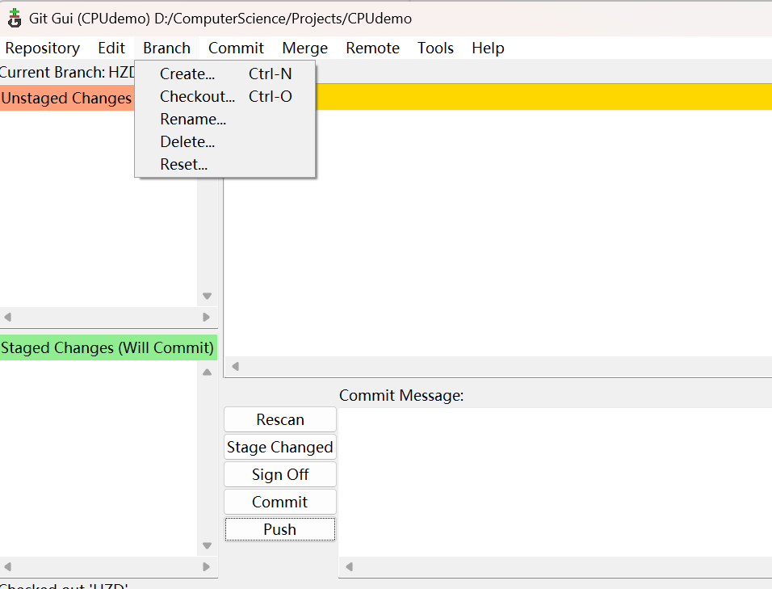

# 注意
不必每次push完都merge，我们过一段时间统一进行merge操作
第一次merge时间暂定为2024年4月30日（周二）

github usage guide
1. Git GUI:
    - git clone
    - create branch (checkout can change branch)
   
    - do merge at github
    - git pull to refresh